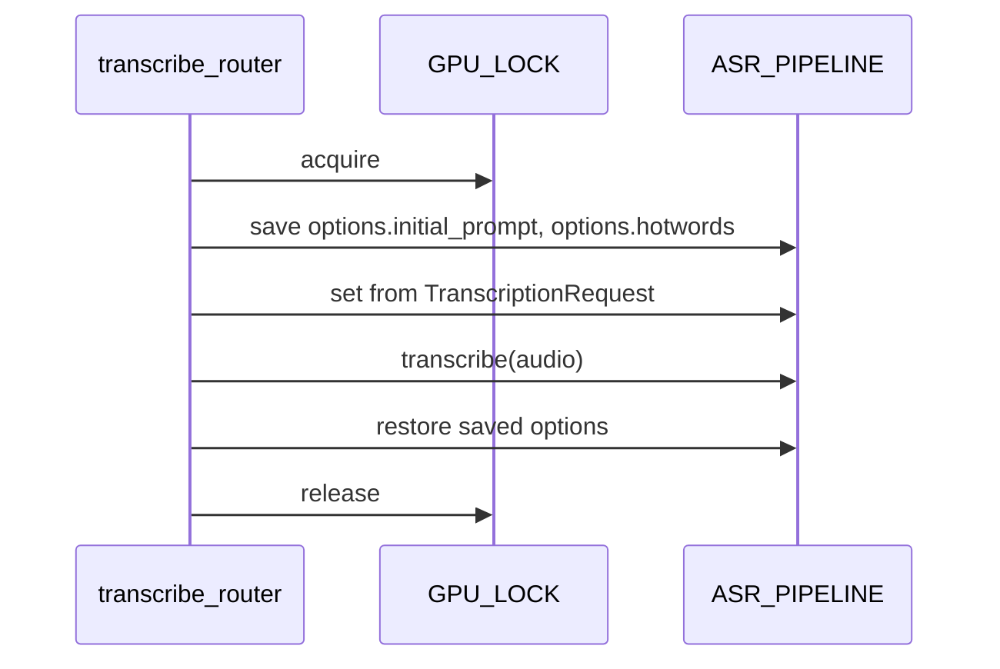
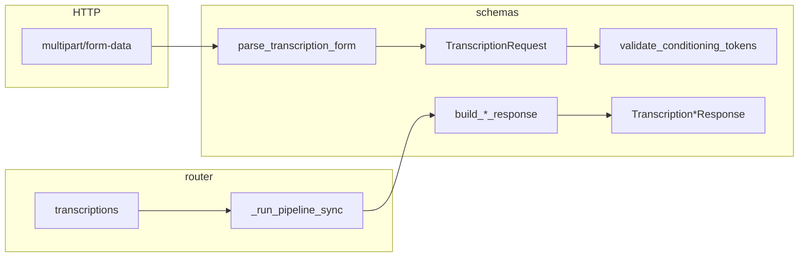

## Context

См. `proposal.md`. Текущий endpoint `POST /v1/audio/transcriptions` принимает multipart form; `prompt` игнорируется. WhisperX `FasterWhisperPipeline.transcribe()` **не** принимает `initial_prompt`/`hotwords` — они задаются через `ASR_PIPELINE.options` (`TranscriptionOptions` faster-whisper). Pipeline — singleton на процесс; запросы сериализуются `GPU_LOCK`.

## Goals / Non-Goals

**Goals:**

- Per-request `prompt` и `hotwords` без перезагрузки модели
- Полный typed-контракт request/response на Pydantic
- Save/restore `options` внутри `GPU_LOCK` (без env-defaults)
- `prompt` работает и при `diarize=true` (документированное WhisperX extension)

**Non-Goals:**

- Env-defaults (`WHISPERX_DEFAULT_PROMPT`, `WHISPERX_DEFAULT_HOTWORDS`)
- OpenAI `keywords` (array) — только `hotwords: string`
- Изменение семантики diarization / response_format
- Проброс `temperature` в ASR (остаётся no-op для совместимости)

## Decisions

### 1. Проброс prompt/hotwords через mutation `options`

**Решение:** перед `transcribe()` под `GPU_LOCK` сохранить текущие `initial_prompt` и `hotwords`, установить значения из запроса (или `None` если не переданы), после transcribe — восстановить.



**Обоснование:** официальный паттерн whisperx (issues #191, #293, #1020); перезагрузка модели на каждый запрос неприемлема.

**Альтернатива (отклонена):** `asr_options` при `load_model` — только load-time, не per-request.

### 2. Маппинг полей API → faster-whisper

| API (form) | ASR options | Примечание |
|------------|-------------|------------|
| `prompt` | `initial_prompt` | OpenAI-совместимое имя в API |
| `hotwords` | `hotwords` | WhisperX extension, string |

Пустая строка или только whitespace → трактуется как «не задано» (`None` в options).

### 3. Формат и нормализация `hotwords`

**Решение:** одна строка (form field `hotwords`), совместимая с faster-whisper. Нормализация на backend (`normalize_hotwords`):

1. `strip()` всей строки (leading/trailing whitespace);
2. пустая строка после strip → `None`;
3. внутренние пробелы **не менять**;
4. запятые **не парсить** и **не преобразовывать**;
5. результат передавать в `options.hotwords` **как есть**.

Реализация: Pydantic `field_validator` / `model_validator` на `TranscriptionRequest.hotwords`.

**Обоснование:** faster-whisper принимает `hotwords: Optional[str]`; любая «умная» обработка (split по запятой, collapse spaces) меняет контракт клиента и может исказить термины.

### 4. Валидация длины и token budget

**Решение:** см. ADR ниже. Кратко:

- API guardrails (символы, после trim): `prompt` max **500**, `hotwords` max **1000**;
- серверная проверка Whisper tokens: `prompt` ≤ **100**, `hotwords` ≤ **150**, совместно ≤ **200**;
- рекомендация клиенту: суммарно ≤ **1500** символов (не блокирует запрос).

Превышение hard-лимитов → HTTP 422.

**Обоснование:** см. ADR — decoder limit faster-whisper **448 tokens**; conditioning не должен съедать budget транскрипции.

### ADR: ограничения `initial_prompt` и `hotwords`

**Решение**

* `initial_prompt` (`prompt` в API): `string`, `maxLength = 500`
* `hotwords`: `string`, `maxLength = 1000`
* суммарно рекомендуется не более `1500` символов
* `trim`; пустая строка → `None`
* серверная проверка:

  * `initial_prompt <= 100 Whisper tokens`
  * `hotwords <= 150 Whisper tokens`
  * совместно `<= 200 Whisper tokens`

**Обоснование**

* `faster-whisper` имеет общий decoder limit **448 tokens**.
* В него входят: service tokens, `initial_prompt`, `hotwords`/conditioning и генерируемая транскрипция текущего аудиочанка.
* Русский текст → больше токенов на тот же объём символов, чем типичный английский.
* `2500` символов RU/RU+EN могут существенно превысить доступный token budget, поэтому прежнее ограничение `500 + 2000` слишком велико.
* Большой conditioning context:

  * уменьшает место для транскрипции;
  * усиливает bias в сторону подсказок;
  * может ухудшать качество при избыточном словаре;
  * увеличивает decoder/prefill overhead.
* `initial_prompt` — только короткий контекст встречи.
* `hotwords` — ограниченный словарь терминов и имён.
* Аудио само не занимает эти 448 tokens, но текст, генерируемый для каждого аудиочанка, занимает.

**Итог**

`500 / 1000 chars` — API guardrails. Основное техническое ограничение — совместный conditioning budget не более примерно **200 Whisper tokens**, чтобы сохранить достаточный запас из 448 tokens для транскрипции.

**Реализация token-count:** tokenizer загруженной ASR-модели (faster-whisper `WhisperTokenizer` через pipeline); подсчёт в Pydantic `model_validator` на `TranscriptionRequest` после нормализации строк.

### 5. prompt + diarize

**Решение:** **разрешить** одновременно. В README и spec явная пометка: *WhisperX extension — несовместимо с OpenAI `gpt-4o-transcribe-diarize`, где prompt запрещён; у нас diarize — отдельный этап pipeline после ASR, конфликта нет.*

### 6. Модель контракта (Pydantic)

**Решение:** единый модуль `src/whisperx_api/schemas.py` — источник правды для OpenAPI, валидации и сериализации. Роутер не содержит ad-hoc dict-сборки ответов.

#### 6.1. Размещение и поток данных



| Слой | Ответственность |
|------|-----------------|
| `parse_transcription_form` | Сборка `TranscriptionRequest` из `Form` + `UploadFile` |
| `TranscriptionRequest` | Нормализация, char-limits, бизнес-правила (diarize, speakers) |
| `validate_conditioning_tokens` | Whisper token budget (100/150/200), нужен tokenizer из `AppState` |
| `build_*_response` | Маппинг результата пайплайна → typed response |
| `transcriptions` | HTTP status, `GPU_LOCK`, вызов пайплайна |

#### 6.2. Перечисления и вспомогательные типы

```python
class ResponseFormat(str, Enum):
    text = "text"
    json = "json"
    verbose_json = "verbose_json"
    diarized_json = "diarized_json"
```

`FormBool` — парсинг form-строк `"true"|"1"|"yes"|...` → `bool | None` (логика текущего `_bool()`).

#### 6.3. Запрос: `TranscriptionRequest`

Собирается dependency `parse_transcription_form(...)`. Поле `file: UploadFile` — обязательное, валидируется на непустой upload.

| Поле | Тип | Default | Источник | Нормализация | Валидация | Использование в пайплайне |
|------|-----|---------|----------|--------------|-----------|---------------------------|
| `file` | `UploadFile` | — | multipart | — | required, non-empty | аудио на диск |
| `model` | `str \| None` | `None` | OpenAI compat | strip | if set: ∈ `{default_model, whisper-1, whisper-large-v3}` else HTTP 400 | no-op (compat) |
| `language` | `str \| None` | `None` | OpenAI | strip; `""` → `None` | — | kwargs transcribe если задан; иначе auto-detect |
| `prompt` | `str \| None` | `None` | OpenAI | strip; `""` → `None` | max 500 chars; ≤100 tokens* | → `options.initial_prompt` |
| `hotwords` | `str \| None` | `None` | **WhisperX ext** | strip; `""` → `None`; внутренние пробелы/запятые as-is | max 1000 chars; ≤150 tokens* | → `options.hotwords` |
| `response_format` | `ResponseFormat` | `json` | OpenAI | lower/strip | enum | выбор response builder |
| `temperature` | `float \| None` | `None` | OpenAI compat | — | — | **no-op** (compat) |
| `timestamp_granularities` | `list[str] \| None` | `None` | OpenAI | — | if set → HTTP 400 unsupported | — |
| `align` | `FormBool` | `None` | WhisperX ext | — | — | этап align |
| `diarize` | `FormBool` | `None` | WhisperX ext | — | — | этап diarize |
| `num_speakers` | `int \| None` | `None` | WhisperX ext | — | if `do_diarize`: ≥1 | DiarizationPipeline |
| `min_speakers` | `int \| None` | `None` | WhisperX ext | — | if `do_diarize`: ≥1, ≤max | DiarizationPipeline |
| `max_speakers` | `int \| None` | `None` | WhisperX ext | — | if `do_diarize`: ≥1 | DiarizationPipeline |

\* token-limits — отдельный шаг `validate_conditioning_tokens(request, tokenizer)` после char-валидации (см. §6.6).

**Вычисляемые флаги** (`@model_validator` / `@computed_field`):

```python
@property
def effective_language(self) -> str | None:
    return self.language or config.default_language or None

@property
def do_diarize(self) -> bool:
    return _form_bool(self.diarize, default=(
        self.response_format == ResponseFormat.diarized_json
        or config.default_diarize
    ))

@property
def do_align(self) -> bool:
    align = _form_bool(self.align, default=config.default_align)
    if self.do_diarize and self.align is None:
        return True  # auto-align при diarize
    return align
```

**Правила speaker-параметров** (перенос из роутера):

- валидация `num_speakers` / `min_speakers` / `max_speakers` **только** при `do_diarize=True`;
- без diarize — параметры игнорируются, HTTP 400 не возвращается;
- `min_speakers > max_speakers` → HTTP 400.

**Правила response_format**:

- `diarized_json` без `do_diarize` → HTTP 400;
- неизвестный format → HTTP 400.

#### 6.4. Ответы: discriminated union по `response_format`

```python
TranscriptionResponse = Annotated[
    TranscriptionJsonResponse
    | TranscriptionVerboseJsonResponse
    | TranscriptionDiarizedJsonResponse,
    Field(discriminator="response_format"),  # если нужен wrapper; иначе match в роутере
]
```

`response_format=text` **не** имеет JSON-модели — возвращается `PlainTextResponse(str)`.

##### `TranscriptionJsonResponse`

```python
class TranscriptionJsonResponse(BaseModel):
    text: str
```

##### `TranscriptionVerboseJsonResponse`

Сохраняет текущую структуру `_build_verbose_json`:

```python
class TranscriptionWord(BaseModel):
    word: str
    start: float
    end: float
    score: float | None = None
    speaker: str | None = None

class TranscriptionSegment(BaseModel):
    id: int
    start: float
    end: float
    text: str
    words: list[TranscriptionWord] | None = None
    speaker: str | None = None

class TranscriptionVerboseJsonResponse(BaseModel):
    task: Literal["transcribe"] = "transcribe"
    language: str | None = None
    text: str
    segments: list[TranscriptionSegment]
```

##### `TranscriptionDiarizedJsonResponse`

Сохраняет текущую структуру `_build_diarized_json`:

```python
class DiarizedSegment(BaseModel):
    type: Literal["transcript.text.segment"] = "transcript.text.segment"
    start: float | None = None
    end: float | None = None
    text: str
    speaker: str | None = None

class TranscriptionDiarizedJsonResponse(BaseModel):
    language: str | None = None
    text: str
    speakers: list[str]
    segments: list[DiarizedSegment]
```

`text` в diarized — многострочный `SPEAKER_XX: ...` из `_build_diarized_text`.

#### 6.5. Builder-функции (pipeline → response)

```python
def extract_full_text(result: dict) -> str: ...

def build_json_response(result: dict) -> TranscriptionJsonResponse: ...

def build_verbose_json_response(
    result: dict, language: str | None
) -> TranscriptionVerboseJsonResponse: ...

def build_diarized_json_response(
    result: dict, language: str | None
) -> TranscriptionDiarizedJsonResponse: ...
```

Builder'ы заменяют `_build_verbose_json` / `_build_diarized_json`; логика форматирования (`hybrid_word_blocks`, `_build_diarized_text`) остаётся в `formatting.py` / helpers, но финальный объект — Pydantic model → `model_dump(exclude_none=True)`.

#### 6.6. Двухфазная валидация conditioning

Pydantic-модель не имеет доступа к ASR tokenizer на этапе pure-form parse. Поэтому:

**Фаза 1** — в `TranscriptionRequest` validators:
- normalize `prompt` / `hotwords`;
- char limits 500 / 1000.

**Фаза 2** — `validate_conditioning_tokens(request, tokenizer) -> None`:
- `count_tokens(prompt) ≤ 100`;
- `count_tokens(hotwords) ≤ 150`;
- `count_tokens(prompt) + count_tokens(hotwords) ≤ 200`;
- `None` не участвует в сумме;
- нарушение → `ValidationError` → HTTP 422.

Tokenizer: `state.ASR_PIPELINE.model.hf_tokenizer` или эквивалент faster-whisper через pipeline (конкретный путь — при реализации, с fallback-тестом в unit).

Вызов: в роутере после `parse_transcription_form`, до пайплайна, если модель загружена.

#### 6.7. Маппинг ошибок

| Условие | HTTP | Источник |
|---------|------|----------|
| Pydantic ValidationError (char, token, type) | 422 | FastAPI handler |
| Unsupported model / response_format / timestamp_granularities | 400 | `TranscriptionRequest` custom validator или роутер |
| Speaker params invalid при diarize | 400 | `TranscriptionRequest` |
| diarized_json без diarize | 400 | `TranscriptionRequest` |
| ASR not loaded | 503 | роутер (вне schemas) |

#### 6.8. OpenAPI / FastAPI integration

- `@router.post(..., response_model=None)` — для `text`/`json` разные content-types; либо `Union` response models с `responses=` dict.
- Form-поля документируются через dependency с явными `Annotated[Form(...), Description(...)]`.
- Extension-поля (`hotwords`, `align`, `diarize`, speaker params) помечаются в docstring/description как **WhisperX extension**.
- `prompt` + `diarize` — description: *WhisperX extension; OpenAI gpt-4o-transcribe-diarize запрещает prompt*.

#### 6.9. Обратная совместимость JSON-ответов

Response models SHALL сериализовать те же ключи и типы, что текущие dict-ответы. Тесты e2e сравнивают `model_validate(actual_json)` — допускается только отсутствие новых полей, rename/delete запрещены без version bump.

**Альтернатива (отклонена):** только prompt/hotwords models — не выполняет требование полного контракта.

### 7. Fix: transcribe без явного language

**Решение:** вызывать `transcribe()` всегда; `language` добавлять в kwargs только если задан non-empty.

## Risks / Trade-offs

- **[Risk] Mutation options на shared pipeline** → Mitigation: только внутри `GPU_LOCK`, save/restore
- **[Risk] Длинный prompt/hotwords съедает token budget** → Mitigation: ADR limits (500/1000 chars, 100/150/200 tokens), документация рекомендации 1500 chars суммарно
- **[Risk] Multipart + Pydantic — больше boilerplate** → Mitigation: одна dependency-функция, покрыта e2e

## Migration Plan

Обратно совместимо: новые поля опциональны. `prompt` начинает работать (ранее no-op) — улучшение, не breaking. Клиенты с пустым prompt не затронуты.

## Open Questions

_(нет — решения зафиксированы пользователем)_
