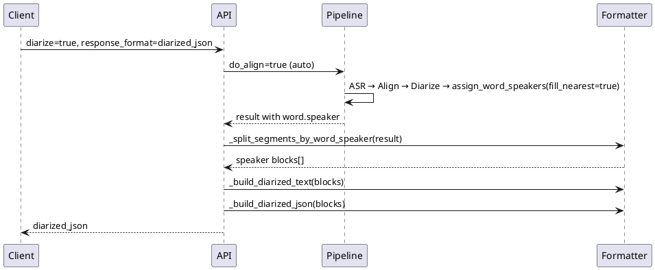

## Context

Текущий пайплайн в `transcribe_router.py`:

```
ASR → [align?] → DiarizationPipeline → assign_word_speakers → _build_diarized_text
```

Проблема: `_build_diarized_text` группирует по `segment.speaker`, который назначается majority vote на весь Whisper-сегмент. При `align=false` (дефолт) word-level speakers отсутствуют. В результате речь двух людей в одном длинном сегменте попадает в одну строку `SPEAKER_X`.

WhisperX `assign_word_speakers` уже умеет назначать спикеров на уровне слов, но сервис это не использует при форматировании вывода.

## Goals / Non-Goals

**Goals:**

- Автоматически включать align при диаризации
- Формировать `diarized_json` из word-level speakers с разбивкой по смене спикера
- Пробросить `num_speakers` в API
- Использовать `fill_nearest=true` для граничных слов

**Non-Goals:**

- Смена diarization-модели (pyannote community-1 → 3.1)
- Настройка гиперпараметров pyannote pipeline
- Предобработка аудио (denoise, VAD)
- LLM post-correction спикеров

## Decisions

### 1. Авто-align: opt-out, не opt-in

**Решение:** при `do_diarize=true` устанавливать `do_align=true`, если клиент не передал `align=false`.

```python
do_align = _bool(align, default=config.default_align)
if do_diarize and align is None:
    do_align = True
```

**Альтернатива:** изменить `default_align` в config на `true` глобально — отклонено, т.к. align замедляет запросы без диаризации.

### 2. Word-level пересборка вывода

**Решение:** новая функция `_split_segments_by_word_speaker(result) -> List[dict]`, которая:

1. Обходит все Whisper-сегменты
2. Для каждого сегмента с `words[]` группирует подряд идущие слова с одинаковым `word.speaker`
3. Формирует блоки `{start, end, text, speaker}`
4. Если `words[]` нет — fallback на исходные сегменты

`_build_diarized_text` и `_build_diarized_json` используют эти блоки вместо сырых Whisper-сегментов.

**PlantUML — поток форматирования:**



### 3. num_speakers в API

**Решение:** добавить `num_speakers: Optional[int] = Form(None)` в endpoint. В `_run_pipeline_sync`:

```python
if num_speakers is not None:
    diarize_segments = state.DIARIZE_PIPELINE(audio, num_speakers=num_speakers)
else:
    diarize_segments = state.DIARIZE_PIPELINE(audio, min_speakers=..., max_speakers=...)
```

**Приоритет:** `num_speakers` > `min_speakers`/`max_speakers`. Валидация: `num_speakers >= 1`, иначе HTTP 400.

### 4. fill_nearest=true

**Решение:** всегда передавать `fill_nearest=True` в `assign_word_speakers`. Это улучшает назначение спикеров словам на стыках интервалов pyannote без изменения API.

**Риск:** слова в тишине/шуме могут получить спикера ближайшего сегмента — приемлемый trade-off для разговорного аудио.

## Risks / Trade-offs

| Риск | Митигация |
|------|-----------|
| Align увеличивает latency при diarize | Включается только при diarize; клиент может `align=false` для скорости |
| Больше сегментов в diarized_json | Ожидаемое улучшение; документировать в README |
| num_speakers с неверным значением ухудшит pyannote | Документировать; рекомендовать тестировать с/без ограничений |
| fill_nearest присвоит шум ближайшему спикеру | Ограниченный эффект; альтернатива — оставить слова без спикера |

## Migration Plan

1. Деплой новой версии API
2. Клиенты с `align=false` — без изменений
3. Клиенты без `align` при diarize — автоматически получат улучшенный вывод
4. Откат: revert коммита, поведение возвращается к segment-level

## Open Questions

- Нужен ли отдельный env `WHISPERX_DEFAULT_ALIGN_ON_DIARIZE` или достаточно логики в коде? → Решено: логика в коде, без нового env
- Стоит ли в `verbose_json` тоже отдавать word-split блоки? → Вне скоупа, только `diarized_json`
