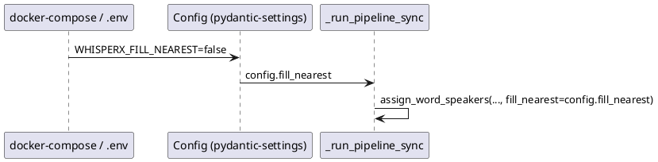

## Context

В `_run_pipeline_sync` вызов диаризации:

```python
result = whisperx.assign_word_speakers(
    diarize_segments, result, fill_nearest=True
)
```

`fill_nearest` управляет назначением спикера словам/сегментам без прямого временного overlap — берётся ближайший pyannote-интервал. Поведение полезно на стыках реплик, но не всегда оптимально; сейчас изменить его можно только правкой кода.

Конфигурация сервиса уже использует `pydantic-settings` с префиксом `WHISPERX_` и bool-полями (`default_align`, `default_diarize`, `no_auth`).

## Goals / Non-Goals

**Goals:**

- Env-параметр `WHISPERX_FILL_NEAREST` для управления `fill_nearest` на уровне деплоя
- Default `true` — сохранить текущее поведение
- Документировать в docker-compose и README

**Non-Goals:**

- Form-параметр API `fill_nearest` для per-request управления — только server-side config
- Изменение логики `assign_word_speakers` в whisperx
- Связка с `align` или другими параметрами диаризации

## Decisions

### 1. Имя env: WHISPERX_FILL_NEAREST

**Решение:** поле `fill_nearest: bool = True` в `Config` → env `WHISPERX_FILL_NEAREST`.

**Альтернатива:** `WHISPERX_DIARIZE_FILL_NEAREST` — отклонено: длиннее, остальные bool-параметры без вложенного префикса (`default_align`, `no_auth`).

### 2. Default true

**Решение:** default `True` в коде и в docker-compose example.

**Обоснование:** текущее захардкоженное поведение; отключение — opt-in для оператора.

### 3. Только env, не API

**Решение:** параметр доступен только через конфигурацию процесса, как `batch_size` или `default_diarize`.

**Обоснование:** пользователь запросил env; per-request override усложняет API без явной потребности.



## Risks / Trade-offs

| Риск | Митигация |
|------|-----------|
| `fill_nearest=false` → слова на границах без спикера | Документировать; default `true` |
| Оператор не знает о параметре | README + docker-compose example |
| Расхождение env и ожиданий после restore-segment-level | Задачи restore-change проверяют default; этот change добавляет opt-out |

## Migration Plan

1. Деплой с новым полем Config (default `true` — без изменений для существующих инсталляций)
2. Оператор при необходимости ставит `WHISPERX_FILL_NEAREST=false` и перезапускает сервис
3. Откат: удалить env или вернуть `true`

## Open Questions

- Нужен ли per-request form-параметр в будущем? → Вне скоупа
