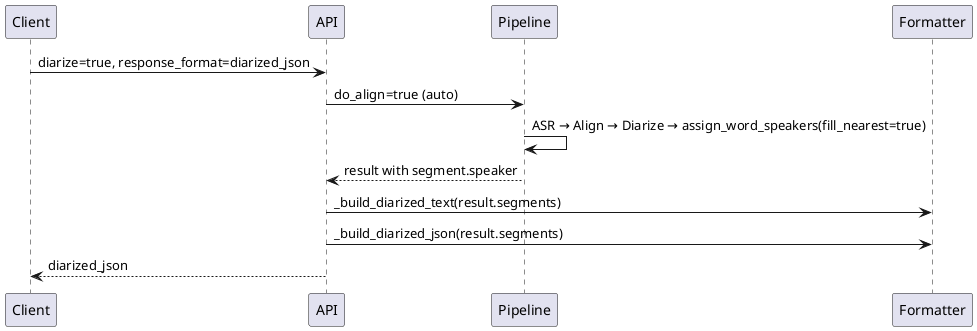

## Context

Текущий пайплайн после change `improve-diarization-quality`:

```
ASR → Align (auto) → Diarize → assign_word_speakers(fill_nearest=true)
                                        │
                                        ▼
                          _split_segments_by_word_speaker()
                          (фильтр words с speaker, join токенов)
                                        │
                                        ▼
                          _build_diarized_text / _build_diarized_json
```

Регрессия подтверждена на реальном аудио: после `20.686s` пропадают сегменты «Ну,» и реплика SPEAKER_02 «отрасли, давайте...». Причина — `_split_segments_by_word_speaker` отбрасывает слова без `word.speaker`, если в сегменте есть хотя бы одно слово со спикером, и пересобирает текст из токенов вместо `seg.text`.

Старая версия (до word-level split) с `align=true` давала корректный вывод, используя `segment.speaker` и `segment.text` напрямую.

## Goals / Non-Goals

**Goals:**

- Вернуть segment-level форматирование `diarized_json` без потери реплик
- Сохранить улучшения пайплайна: авто-align, `fill_nearest`, `num_speakers`
- Минимальный diff — удалить word-level форматтер, откатить сигнатуры builder-функций

**Non-Goals:**

- Гибридный форматтер (split только при нескольких спикерах в сегменте) — отложено
- Изменения diarization-модели или гиперпараметров pyannote
- Word-level split в `verbose_json` — уже есть через `words[]`, не трогаем

## Decisions

### 1. Полный откат форматтера, не гибрид

**Решение:** удалить `_split_segments_by_word_speaker`, вернуть `_build_diarized_text(result)` и `_build_diarized_json(result, ...)` к итерации по `result["segments"]`.

**Альтернатива:** гибридный форматтер (вариант 2 из explore) — отклонён: пользователь выбрал вариант 1 (минимальный откат); гибрид можно оформить отдельным change позже.

### 2. Сохранить авто-align и fill_nearest

**Решение:** не трогать логику в `_run_pipeline_sync` и `transcriptions()` — только слой форматирования ответа.

**Обоснование:** авто-align и `fill_nearest` улучшают `segment.speaker` и `words[].speaker` в `verbose_json`; регрессия была именно в word-level пересборке вывода.

### 3. Поведение _build_diarized_text без изменений

**Решение:** группировка последовательных сегментов с одним `segment.speaker` в одну строку `SPEAKER_X: text` — как в версии `4edf7a4`.



## Risks / Trade-offs

| Риск | Митигация |
|------|-----------|
| Два спикера в одном длинном Whisper-сегменте снова в одной строке | Осознанный trade-off варианта 1; гибридный форматтер — отдельный change |
| Клиенты, ожидавшие word-level split в diarized_json | Документировать в README; структура сегментов возвращается к Whisper-гранулярности |
| Потеря «точности» на стыках спикеров | Segment.speaker = majority overlap, менее шумно чем per-word |

## Migration Plan

1. Деплой с откатом форматтера
2. Клиенты получают больше целостного текста, меньше ложных смен спикера
3. Откат change: revert коммита

## Open Questions

- Нужен ли follow-up change на гибридный форматтер? → Вне скоупа, по запросу после валидации варианта 1
