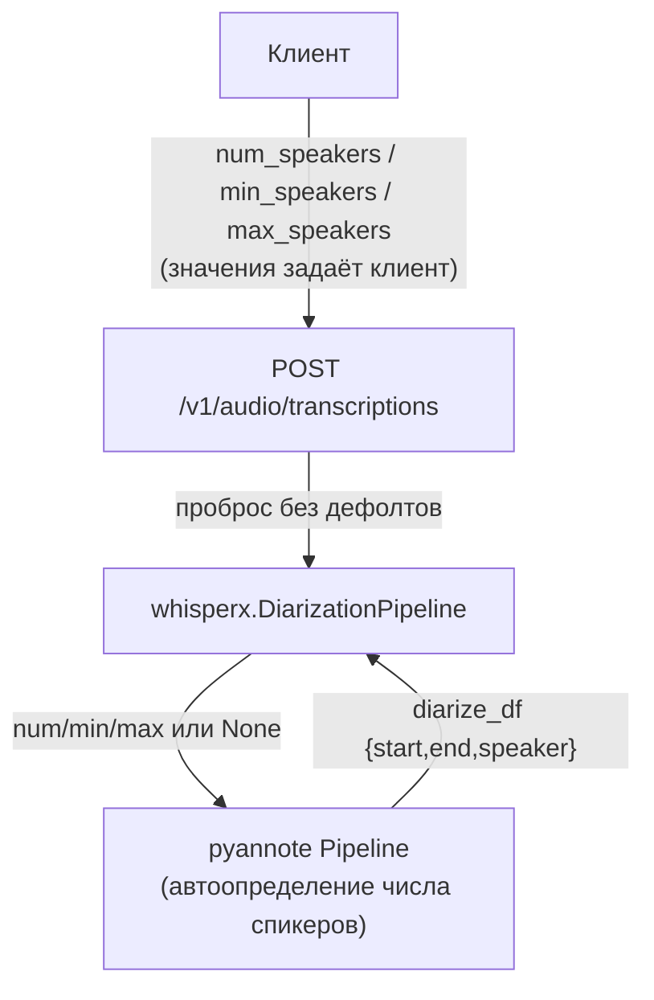
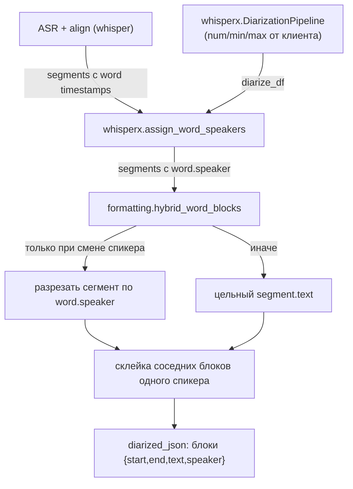

## Context

Пайплайн диаризации в `src/whisperx_api/transcribe_router.py:_run_pipeline_sync`:

```
ASR (whisper) → align (word timestamps) → DiarizationPipeline (pyannote community-1) → assign_word_speakers(fill_nearest)
```

`whisperx.DiarizationPipeline` (`whisperx/diarize.py:91-182`) — тонкая обёртка над pyannote `Pipeline`, которая уже умеет:
- принимать `num_speakers`/`min_speakers`/`max_speakers` и передавать их в pyannote (`diarize.py:156-161`);
- при `None` — оставить pyannote самому определять число спикеров (автоопределение);
- возвращать `diarize_df` `{segment, speaker, start, end}`.

`whisperx.assign_word_speakers` (`diarize.py:185-263`) даёт `segment.speaker` (majority vote) и `word.speaker` (то же на уровне слова).

Проблемы качества:

1. **Число участников.** pyannote без ограничений оверсплитит (4 вместо 3). Определение числа спикеров — уже встроенная функция фреймворка через `num/min/max`, поэтому задача сводится к пробросу значений с клиента, а не к собственному подсчёту.
2. **Маппинг текста.** Текущий форматтер `_build_diarized_json`/`_build_diarized_text` использует только `segment.speaker` (majority vote), поэтому реплики разных людей внутри одного Whisper-сегмента сливаются. Ранее word-level пересборка была откачена (`restore-segment-level-diarization`) из-за потери реплик (отбрасывались слова без `word.speaker`, текст пересобирался из токенов).

Требование: максимально переиспользовать фреймворки, минимум кастомных решений.

## Goals / Non-Goals

**Goals:**

- Число участников определяет клиент через `num_speakers`/`min_speakers`/`max_speakers`; бэкенд пробрасывает их в `whisperx.DiarizationPipeline` без значений по умолчанию
- Автоопределение pyannote при отсутствии параметров (`None`)
- Точная word-level атрибуция текста участнику БЕЗ потери реплик
- Склейка соседних блоков одного спикера в один репликовый блок

**Non-Goals:**

- Кастомные модули подсчёта/слияния числа спикеров на бэкенде
- Замена `whisperx.DiarizationPipeline` / переписывание `assign_word_speakers`
- Смена транскрипционной модели (whisper)
- LLM post-correction, денойз, дообучение

## Decisions

### 1. Число участников: проброс `num/min/max` в `whisperx.DiarizationPipeline`

**Решение:** бэкенд не вычисляет и не задаёт число спикеров. Значения `num_speakers`/`min_speakers`/`max_speakers` принимаются из API и передаются в `whisperx.DiarizationPipeline` напрямую; если параметр отсутствует — передаётся `None` (pyannote автоопределение). Приоритет `num_speakers` > `min`/`max`.



**Обоснование:** определение числа спикеров — уже встроенная функция pyannote через `num/min/max`; кастомный подсчёт/слияние кластеров дублировал бы фреймворк. Это максимальное переиспользование при минимуме кода.

### 2. Гибридный word-level форматтер (без потери текста)

**Решение:** единственный кастомный модуль `formatting.py` для `diarized_json`, работающий с результатом `whisperx.assign_word_speakers`:

1. разрезает Whisper-сегмент на блоки по смене `word.speaker` **только если** в сегменте реально >1 спикера;
2. текст блока: один спикер → цельный `segment.text`; несколько → пересборка из `words[]` с аккуратной конкатенацией (пунктуация встроена в слова);
3. слово без `word.speaker` не отбрасывается — блок отступает к fallback на `segment.text`;
4. соседние блоки одного спикера склеиваются в один репликовый блок.

**Альтернатива (отклонена):** вернуть старый `_split_segments_by_word_speaker` — отбрасывал слова без спикера, терял реплики. Новый подход использует результат `assign_word_speakers` и минимизирует поверхность пересборки текста.



### 3. Конфигурируемая модель диаризации

**Решение:** поле `diarize_model` в `Config` (env `WHISPERX_DIARIZE_MODEL`, default `pyannote/speaker-diarization-community-1`). `whisperx.DiarizationPipeline` конструируется с `model_name=config.diarize_model`.

**Обоснование:** число участников зависит от модели; `DiarizationPipeline` уже принимает `model_name`, смена модели — это тот же фреймворк.

## Risks / Trade-offs

| Риск | Митигация |
|------|-----------|
| Автоопределение pyannote оверсплитит (4 вместо 3) | Автоопределение количества участников улучшается за счёт параметров от клиента: клиент передаёт `num_speakers=3` или сужает диапазон `min/max` |
| `num_speakers` вручную неверен | Клиент может передать и точное значение, и диапазон `min/max`; документировать |
| Word-level пересборка снова теряет текст | Гибрид: режем только при смене спикера, fallback на `segment.text`, без фильтрации слов |
| Fallback присуммирует текст сегмента доминантному `seg.speaker`, если разбивка невозможна (напр., часть слов без `word.speaker`) | Осознанный компромисс «без потери текста»: часть реплик может быть неверно атрибутирована спикеру; документировано в spec/README |
| Два говорящих слиты в один кластер pyannote | Не лечится пробросом `num/min/max` (нельзя разбить); сигнал к смене модели `WHISPERX_DIARIZE_MODEL` |
| Клиент не передаёт параметры → автоопределение | Документированное поведение; соответствует текущему API |

## Migration Plan

1. Деплой: проброс `num/min/max` (без дефолтов на бэкенде) + гибридный форматтер
2. Клиенты передают `num/min/max` по своему усмотрению
3. Клиенты, не передающие параметры, получают автоопределение pyannote
4. Откат: revert коммита — возврат к segment-level и текущему поведению

## Open Questions

- Нужно ли жёстко валидировать `min_speakers <= max_speakers` на бэкенде? → **Решено: да.** Бэкенд выполняет проверку параметров от клиента и возвращает HTTP 400 при `min_speakers > max_speakers`